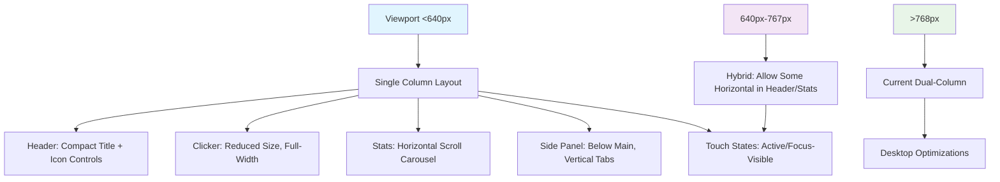

# Mobile UI Overhaul Plan for CannaClicker

## Executive Summary
The current UI suffers from poor mobile responsiveness, leading to usability issues like horizontal scrolling, oversized elements, and missing visual elements on smartphones. This plan addresses the issues identified in `mobile_UI.md` and through code analysis, incorporating best practices for mobile idle games (e.g., touch-friendly interfaces, simplified vertical layouts, optimized performance). The goal is a fluid, engaging experience on devices <640px wide, prioritizing critical fixes for playability.

Estimated effort: 8-12 hours implementation + 2-4 hours testing on emulators/real devices. Dependencies: Access to mobile dev tools (Chrome DevTools), potential image optimization tools for hero backgrounds.

## Consolidated Issues
From `mobile_UI.md` and code review (CSS/TS files):

### Critical (Usability Blockers)
1. **Missing Hero Image on Mobile**: CSS media query starts at 768px [`cannaclicker/src/styles/index.css[23-33]`](cannaclicker/src/styles/index.css:23). No background visuals on small screens, making the app feel empty.
2. **HUD/Toast Collisions**: Fixed HUD at top-4px overlaps header on small viewports [`cannaclicker/src/app/ui/mountRoot.ts[40-47]`](cannaclicker/src/app/ui/mountRoot.ts:40). Toasts block logo/nav.
3. **Horizontal Scrolling in Controls**: Header action strip uses `flex-nowrap` + large buttons, forcing scroll on <480px [`cannaclicker/src/app/ui/mountHeader.ts[30-38]`](cannaclicker/src/app/ui/mountHeader.ts:30), [`cannaclicker/src/app/ui/components/controls.ts[21-55]`](cannaclicker/src/app/ui/components/controls.ts:21).
4. **Oversized Clicker Button**: Min-height 18rem + icon 12rem leaves no room for content in portrait mode [`cannaclicker/src/styles/index.css[78-118]`](cannaclicker/src/styles/index.css:78). Poor touch targeting.
5. **Stats Ribbon Stacking/Scrolling**: Min-width 13rem per stat causes excessive vertical scroll or wrap on narrow screens [`cannaclicker/src/styles/index.css[183-211]`](cannaclicker/src/styles/index.css:183).

### High (Visual/Layout Issues)
1. **Header Title Overflow**: Clamp(2.6rem, 6.5vw, 4.6rem) + padding causes crowding in landscape [`cannaclicker/src/styles/index.css[272-335]`](cannaclicker/src/styles/index.css:272).
2. **Tabs/Filter Pills Wrapping**: `tracking-[0.3em]` + `whitespace-nowrap` leads to ugly breaks or scroll [`cannaclicker/src/styles/index.css[614-624,850-864]`](cannaclicker/src/styles/index.css:614).
3. **Prestige Badge Placement**: Fixed right alignment creates new lines on small widths [`cannaclicker/src/styles/index.css[213-260]`](cannaclicker/src/styles/index.css:213).
4. **High Padding/Margins**: Cards (stats, abilities, upgrades) use generous spacing, increasing scroll length [`cannaclicker/src/styles/index.css[183-371,544-575]`](cannaclicker/src/styles/index.css:183).
5. **Click Label Spacing**: `letter-spacing: 0.45em` clips text on small displays [`cannaclicker/src/styles/index.css[123-127]`](cannaclicker/src/styles/index.css:123).

### Medium (Polish/Feedback)
1. **Missing Touch Feedbacks**: Hover-only states; no `:active` or focus-visible for touch [`cannaclicker/src/styles/index.css[618-624,858-864]`](cannaclicker/src/styles/index.css:618).
2. **Side Panel Tabs/Filters**: Small, spaced elements hard to tap accurately.
3. **Ability/Upgrade Cards**: Grid layouts (e.g., `md:grid-cols-2`) stack poorly without mobile tweaks.
4. **Performance**: Large hero images (1920px+) load slowly on mobile; no lazy-loading in some icons.

Additional from analysis:
- Layout grid (`lg:grid-cols-[1fr_1fr]`) stacks vertically on mobile but secondary column (shop) feels cramped without adjustments.
- No viewport-specific conditional rendering in TS (e.g., hide non-essential stats).
- Touch targets <44px in some buttons (e.g., filters), violating mobile guidelines.

## Prioritization
- **Critical (Phase 1: 4-6 hours)**: Fix scrolling/collisions, hero image, clicker sizing. Ensures basic playability.
- **High (Phase 2: 3-4 hours)**: Adjust layouts, paddings, text spacing. Improves visual flow.
- **Medium (Phase 3: 1-2 hours)**: Add feedbacks, optimize performance. Enhances engagement.

## Responsive Breakpoints Strategy
Use Tailwind's defaults + custom media queries in CSS for precision:
- **Mobile Portrait (<640px)**: Single-column layout, reduced sizes/paddings, vertical stacking, touch-optimized (min 48px buttons).
- **Mobile Landscape (640px-767px)**: Compact horizontal elements where possible, but prioritize vertical scroll.
- **Tablet (768px-1024px)**: Current behavior with tweaks (e.g., smaller hero).
- **Desktop (>1024px)**: Unchanged.

Add to `cannaclicker/src/styles/index.css`:
```css
@media (max-width: 639px) { /* Mobile-specific */
  /* Adjustments here */
}

@media (min-width: 640px) and (max-width: 767px) { /* Landscape/mobile tweaks */
  /* Fine-tune for wider small screens */
}
```
- Use `clamp()` with mobile-first values (e.g., `clamp(12rem, 20vw, 18rem)` for clicker).
- Viewport units (vw/vh) capped to prevent extreme scaling.
- Test at common breakpoints: 320px (iPhone SE), 375px (iPhone 12), 480px (landscape).

## Mobile-Optimized Layout Descriptions
### Overall Structure
- **Root/Layout**: Single column on mobile (`grid-cols-1`), full-width cards. Increase `gap-2` to `gap-3` for finger spacing.
- **Header**: Logo left, title center (2 lines if needed), controls as icon-only row with overflow menu (⋮ for extras).
- **Primary Column (Main)**: Clicker card full-width, stats as horizontal scrollable carousel or 1-col grid.
- **Secondary Column (Side Panel)**: Full-width below main on mobile; tabs as segmented control (horizontal scroll if needed).

### Wireframe Descriptions (Text-Based)
1. **Header**:
   - Top: Logo (smaller: 48px) | Title (1.8rem, wrap) | Menu Icon (hamburger for controls).
   - Controls: Icons only, 40px touch targets, horizontal scroll if >4 items.

2. **Info Ribbon (Stats)**:
   - Horizontal flex with `overflow-x-auto`, snap-scroll. Each stat: 140px min-width, reduced padding (px-2 py-1).
   - Prestige badge below or as floating action button (FAB) bottom-right.

3. **Clicker Card**:
   - Full-width, reduced height (clamp(12rem, 24vw, 16rem)).
   - Icon: clamp(8rem, 16vw, 12rem).
   - Stats below in 1-col vertical list.
   - Label: Reduced tracking (0.2em), center-aligned.

4. **Side Panel (Shop/Upgrades/Research)**:
   - Tabs: Horizontal scroll, icons + abbreviated text (e.g., "Shop" -> "Shp"), 44px height.
   - Content: Vertical list, cards with reduced padding (p-2), full-width buttons.
   - Filters: Larger pills (px-4 py-2), full-width or fewer options (e.g., toggle all/none).

5. **Abilities/Prestige/Milestones**:
   - Grid: 1-col on mobile, cards taller for thumb swipes.
   - Modals: Full-screen on mobile for better readability.

### Mermaid Diagram: Responsive Layout Flow


## Outlined Changes
### CSS (Primary Focus: index.css)
- **Hero Image**: Add mobile variant in media <768px: Use smaller image (e.g., 800px crop) or solid gradient fallback. Update `mountRoot.ts[35-38]` to set mobile-specific CSS var.
- **Paddings/Margins**: Reduce card paddings by 30% on mobile (e.g., `p-4` -> `p-2`). Adjust clamps: e.g., clicker padding `clamp(1rem, 2vw, 1.5rem)`.
- **Min-Widths/Sizes**: Stats: `minmax(140px, 1fr)`; Clicker: `min-height: clamp(12rem, 24vw, 18rem)`.
- **Text/Spacing**: Reduce `letter-spacing` (0.45em -> 0.2em), add `hyphens: auto` for wrapping.
- **Touch Feedbacks**: Add `:active { transform: scale(0.98); }` to buttons/links. Ensure `focus-visible` rings.
- **Scrolling**: Add `overflow-x-auto` with `-webkit-overflow-scrolling: touch` for horizontal elements.
- **Performance**: Lazy-load images in TS components; compress hero PNGs.

### TS Adjustments (Minimal: ui/mount*.ts, components/*.ts)
- **Dynamic Sizing**: In `mountHeader.ts`, detect viewport and add classes (e.g., `is-mobile` if window.innerWidth < 640).
- **Conditional Rendering**: Hide secondary stats on mobile (e.g., in stats.ts, render only top 3). Use `matchMedia` for tab/filter simplification.
- **Event Handling**: In `wireSidePanel.ts`, add touchstart for better responsiveness.
- **HUD Positioning**: In `mountRoot.ts`, set top offset based on safe-area-inset-top for notched devices.

## Implementation Effort & Dependencies
- **Phase 1 (Critical)**: 4 hours CSS tweaks + 1 hour TS adjustments. Test: Chrome DevTools mobile emulation.
- **Phase 2 (High)**: 3 hours layout changes. Test: Real device (iOS/Android) for touch/scroll.
- **Phase 3 (Medium)**: 2 hours polish. Dependencies: Image editor for mobile hero; browserstack/lighthouse for perf audit.
- Risks: Breaking desktop; over-optimization hurting animations. Mitigate with feature flags (e.g., CSS vars).

## Next Steps
1. Implement Phase 1 in Code mode.
2. Test on devices, iterate.
3. Switch to Code mode for full rollout.

This plan is ready for review. Approve or suggest changes?